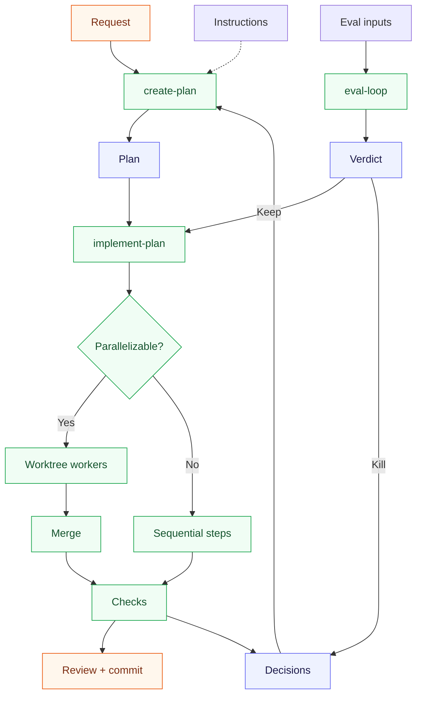

# Agent Workspace Harness

A harness for coding agents that preserves memory and gives structure to development workflows across **Codex, Claude Code, Cursor, and GitHub Copilot**. This harness consists of instructions, skills, and small scripts inside one Git repository.

## Memory persistence

Agent sessions resets, while you can manually updated the coding harness memory, plan, decisions, and test results stay in your repository.

This harness automatically updates the repo's memory across different coding harnesses so that the next session or team mate can continue from that record.

It combines three components:

- **Plans** in `_plans/`: define the work, dependencies, and checks before code changes.
- **Memory** in `_plans/DECISIONS.md`: record rejected approaches, evidence, and conditions for reconsideration.
- **Evaluations** in `_eval/`: measure whether a change improves classifier quality, reduces error rates, or resolves pipeline failures.
- **Optional Postgres MCP** lets agents query a temporary production database copy through a read-only connection.

## Installation and prerequisites

Run this command from the root of your app repository:

```bash
curl -fsSL https://raw.githubusercontent.com/fedeee/agent-workspace-harness/main/install.sh | bash
```

It copies the selected skills and rules. It preserves the decisions ledger and app README.
For existing `CLAUDE.md` and `AGENTS.md` files, it appends a harness section.
Existing MCP server entries and hook settings take precedence during merges.

### Prerequisites

For the core harness, you need **Bash**, **Git**, an existing Git repository, and one supported coding agent.
The one-line installer also needs **curl**.

Optional features need additional tools:

| Feature                                    | Prerequisites                                                     |
| ------------------------------------------ | ----------------------------------------------------------------- |
| MCP configuration and existing hook merges | `jq`                                                              |
| Codex MCP configuration                    | Python 3.11+                                                      |
| Shell deny hook and file evaluation        | Python 3                                                          |
| Context7 and Playwright MCP servers        | Node.js with `npx`                                                |
| Production database sidecar                | Docker with Compose, Python 3, AWS CLI, and access to the S3 dump |

Set `HARNESS_PYTHON=/path/to/python3.11` if Codex MCP configuration needs a newer Python than your default.
Core planning and memory need no database or MCP server.

## Skills and workflows

Skills are reusable instructions that an agent follows inside your repository.
The core installation includes four skills. Two optional skills add evaluation and database access.

| Skill                                                                | What it does                                                                        | Installation               |
| -------------------------------------------------------------------- | ----------------------------------------------------------------------------------- | -------------------------- |
| [`create-plan`](.claude/skills/create-plan/SKILL.md)                 | Reads past decisions and writes a plan with code context, dependencies, and checks. | Core                       |
| [`implement-plan`](.claude/skills/implement-plan/SKILL.md)           | Executes a plan, updates its checklist, tests changes, and reviews the result.      | Core                       |
| [`commit`](.claude/skills/commit/SKILL.md)                           | Stages and commits changes locally. Never pushes.                                   | Core                       |
| [`update-all-md-docs`](.claude/skills/update-all-md-docs/SKILL.md)   | Reviews Markdown files and updates stale documentation and references.              | Core                       |
| [`eval-loop`](.claude/skills/eval-loop/SKILL.md)                     | Tests one hypothesis and records evidence plus a keep or kill verdict.              | Optional: evaluations      |
| [`mount-production-db`](.claude/skills/mount-production-db/SKILL.md) | Restores an S3 dump into a temporary local Postgres sidecar for read-only queries.  | Optional: database sidecar |

### Plan and implement a change

In Codex, start with:

```text
$create-plan add a fuzzy search fallback
```

Review the generated file in `_plans/`, then pass its path to the implementation skill:

```text
$implement-plan _plans/<generated-plan>.plan.md
```

In Claude Code or Cursor, use `/create-plan` and `/implement-plan` with the same arguments.

The implementation skill follows dependencies in the plan.
Independent steps run as parallel workers in isolated Git worktrees.
Dependent steps run in order. The agent combines changes, runs checks, and reviews the result.
Use `$commit` or `/commit` when you want a local commit.

### How the components connect



Plans, evidence, and the decisions ledger remain available to future sessions.
The ledger holds **negative architecture decision records (ADRs)**: approaches that evidence ruled out.
Each entry states its scope, evidence, and conditions for reconsideration.
Plan creation reads this memory; implementation and evaluation add rejected approaches when evidence supports them.
The template starts with an empty ledger. [Example entries](_plans/DECISIONS.example.md) show the format.

### Evaluate a hypothesis

Test classifier or pipeline changes against fixed inputs before implementation.

1. Add one hypothesis and metric target to [`_eval/BACKLOG.md`](_eval/BACKLOG.md).
2. Run `$eval-loop H1` in Codex, or `/eval-loop H1` in Claude Code or Cursor.
3. Review the evidence and keep or kill verdict before implementation.

Classifier evaluation needs at least **20 labelled rows** in `_eval/GOLD.csv`; `unsure` rows do not count.
Never score `GOLD.example.csv`.
Keep a change only if precision error drops and false omission rate does not rise.
Pipeline evaluation needs a baseline and target; keep a change only if it meets the target without new errors.

Use frozen files, or run `mount-production-db` with an S3 dump for a temporary, read-only database copy.
Pass the full S3 URI; no specific bucket layout or manual download is required:

```text
$mount-production-db s3://your-bucket/path/to/app.dump
```

Use `/mount-production-db` in Claude Code or Cursor.
Configure AWS CLI access to the backup, with region and profile defaults in `_local/eval.env`.
The skill downloads the backup into `/tmp/eval-sidecar-<id>/` and restores it with `pg_restore`.

Postgres MCP connects the agent to this local sidecar as the read-only `eval_ro` user.
The agent can inspect data and diagnose pipeline errors without changes to the source database.
See the [evaluation guide](_eval/README.md) for metrics and the [database setup guide](_local/README.md) for configuration.

## Who is this for?

This harness is for developers and teams who use coding agents across multiple sessions.
It is useful when you need to:

- Resume complex changes with an explicit plan and progress record.
- Use difference coding harnesses in the same repo
- Preserve evidence about failed approaches so future sessions can avoid them.
- Coordinate independent implementation steps in one repository.
- Measure classifier or pipeline changes before you adopt them.

The repository stores the workflow state, and the agent follows it during each session.
You remain responsible for review and release. The harness does not run a separate background scheduler or deployment platform.

---

License: MIT
