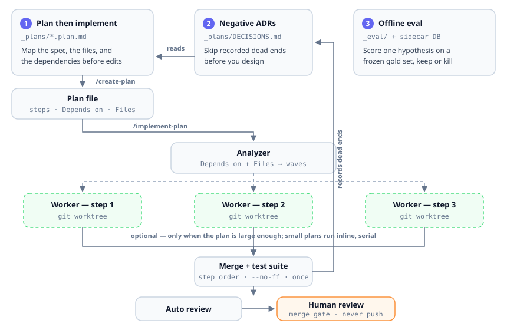

# Agent Workspace Harness

A layered harness for AI coding agents: Negative ADRs, spec-first plan-then-implement with parallel execution in git worktrees, and offline empirical eval loops.

## The problem

LLM context windows reset. Across chat sessions, agents repeat the same
flawed patterns: hardcoded keyword lists, brittle regular expressions,
and extra configuration dials.

Prompt rules are not memory. A new chat session repeats last week's
failure unless that failure is on disk.

## The solution

This harness adds three durable layers to your repository:

1. **Plan then implement** (`_plans/`): The agent maps dependencies and
   writes pseudocode before it edits source files.
2. **Negative ADRs** (`_plans/DECISIONS.md`): Classic ADRs record what
   you adopted. This ledger records what you disproved. Agents then skip
   those dead ends.
3. **Offline eval** (`_eval/`): Test one hypothesis against a frozen
   gold set on a local, read-only database sidecar.



## Who's this for

The Agent Workspace Harness is built specifically for software engineers, data scientists, and technical founders who use AI coding agents (like Claude or Cursor) to build, refactor, or maintain data-intensive systems, search pipelines, and classification logic.

It provides a lightweight, local operating system for working with AI coding agents. Rather than running a heavyweight external control plane, it relies on files in the repo to keep agents aligned, prevent repeated mistakes, and coordinate parallel execution.

*Comparison: Repo-native harness vs. enterprise agent infrastructure*

| | This harness | Enterprise agent infra |
|---|---|---|
| Control plane | The LLM, reading the plan | A scheduler/runtime |
| State | Markdown files in git | Databases, checkpoint stores |
| Failure handling | Agent reads the error, fixes the plan | Retry policies, dead-letter queues |
| Isolation | git worktrees + a deny hook | Containers, VMs, network policy |
| Trust model | Human reviews before push | System enforces without a human |
| Cost to run | A repo and an agent | A platform team |

## How to use the three layers

### 1. Plan then implement

The agent writes a spec before it edits product code.

Run `/create-plan <description>`. Example:
`/create-plan add-fuzzy-search-fallback`.
The agent writes a markdown file in [`_plans/`](_plans/).

After you review the spec, run `/implement-plan`.
The agent executes the steps in order and checks them off.

### 2. Negative ADRs

The ledger is [`_plans/DECISIONS.md`](_plans/DECISIONS.md).
Classic ADRs record what you adopted. This file records what you disproved.
The template ships it empty. Example entries live in
[`DECISIONS.example.md`](_plans/DECISIONS.example.md).

Memory is automatic. You do not tell the agent to memorize a failure.

- `/create-plan` reads the ledger before it designs.
- `/implement-plan` appends an entry when implementation kills an approach.
- `/eval-loop` appends an entry when a hypothesis is dead.

A new chat session reads that file first. It then skips those dead ends.

### 3. Offline eval

Score one hypothesis on a frozen gold set.
Do not implement the change until a cycle keeps it.

Do this setup once:

1. Write the class rules in [`_eval/GOLD.md`](_eval/GOLD.md).
2. Label at least **20** rows in [`_eval/GOLD.csv`](_eval/GOLD.csv).
   Set `gold` to `in_class` or `out_class`. Do not count `unsure` rows.
   Label one qualified row and one excluded row.
3. Copy `_local/eval.env.example` to `_local/eval.env`. Fill the dump
   fields.
4. Run `/mount-production-db`.

For each idea:

```
/create-plan  →  _eval/BACKLOG.md  →  /eval-loop H1  →  /implement-plan
```

1. Run `/create-plan` with the change you want to measure.
2. Add one open item to [`_eval/BACKLOG.md`](_eval/BACKLOG.md).
   Write one sentence. Name one predicted metric. Use the next free id
   (`H1`, `H2`, …).
3. Run `/eval-loop H1`.
4. If the verdict is keep, run `/implement-plan`.

Keep a change only if precision error drops and recall error does not
rise.

Do not score `GOLD.example.csv`.
See [`_eval/README.md`](_eval/README.md) for metrics and other commands.

## Workspace layout

```
.
├── CLAUDE.md                 # Primary system instructions for agents
├── AGENTS.md                 # IDE entry point (Cursor / Copilot)
├── _plans/                   # Specs + negative ADR ledger
├── _eval/                    # Eval protocol, cycles, gold schemas
├── _local/                   # Machine defaults (eval.env is gitignored)
├── scripts/worktree_agent.sh # Isolated git worktrees of this tree
├── .cursor/hooks.json        # Blocks git push, ssh, commit --no-verify
├── .claude/ / .cursor/ / .github /
└── .mcp.json                 # Shared MCP tool definitions
```

## Quickstart

Agents follow [CLAUDE.md](CLAUDE.md).

```bash
cp _local/eval.env.example _local/eval.env
```

Fill the bucket, region, and database fields before `/mount-production-db`.
Label at least 20 gold rows before `/eval-loop`.

### Commands

| Command                  | Action                                                                                   |
| ------------------------ | ---------------------------------------------------------------------------------------- |
| `/create-plan <desc>`    | Draft a spec with steps, `Depends on` edges, and pseudocode.                             |
| `/implement-plan [file]` | Execute a spec. Independent steps run as parallel worktree workers. Merge, test, review. |
| `/mount-production-db`   | Restore a production dump into a local sidecar container.                                |
| `/eval-loop`             | One observe → hypothesize → test → keep/kill cycle.                                      |
| `/eval-loop H1`          | Test hypothesis `H1` this cycle.                                                         |
| `/commit`                | Stage and commit this repo. Agents never run `git push`.  |

A hook also blocks `git push`, `ssh`, and `git commit --no-verify`.

Isolated worktrees:

```bash
scripts/worktree_agent.sh <branch>
scripts/worktree_agent.sh --clean <branch>
```

## Tooling

This design keeps bash small. A hook blocks forbidden git and ssh
commands. Most other rules live in markdown and skills.

| Path                                  | Role                                                                                                                            |
| ------------------------------------- | ------------------------------------------------------------------------------------------------------------------------------- |
| `.cursor/hooks/deny-shell.py`         | Deny `git push`, `ssh`, and `git commit --no-verify`. Cursor and Claude Code both run this script.                              |
| `scripts/worktree_agent.sh`           | Isolated git worktree of this tree. No `repos/` name. Copies `_local/eval.env` when it exists.                                  |
| `.claude/skills/mount-production-db/` | Docker Postgres sidecar: fetch the S3 dump, create `eval_ro`, tear down. Keep the Cursor mirror in `.cursor/skills/` identical. |

## MCP servers

Shared configuration in `.mcp.json`, `.cursor/mcp.json`, and
`.vscode/mcp.json`:

| Server                                                    | Purpose                                        |
| --------------------------------------------------------- | ---------------------------------------------- |
| [Context7](https://github.com/upstash/context7)           | Library and framework docs                     |
| [Playwright](https://github.com/microsoft/playwright-mcp) | Browser automation and end-to-end checks       |
| Postgres sidecar                                          | Read-only database from `/mount-production-db` |

The Postgres MCP server fails on a fresh workspace until you run
`/mount-production-db`. That error is expected. Agents must ignore it unless
the user asked for `/eval-loop`, `/mount-production-db`, or sidecar SQL.
Do not edit `.mcp.json` to hide it.

## Further reading

| Topic            | Where                                 |
| ---------------- | ------------------------------------- |
| Eval protocol    | [\_eval/README.md](_eval/README.md)   |
| Gold rules       | [\_eval/GOLD.md](_eval/GOLD.md)       |
| Hypothesis list  | [\_eval/BACKLOG.md](_eval/BACKLOG.md) |
| Plan format      | [\_plans/README.md](_plans/README.md) |
| Machine defaults | [\_local/README.md](_local/README.md) |

## License

MIT
