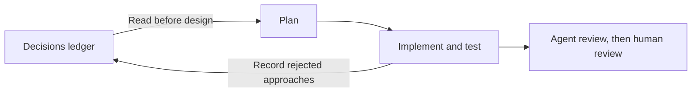
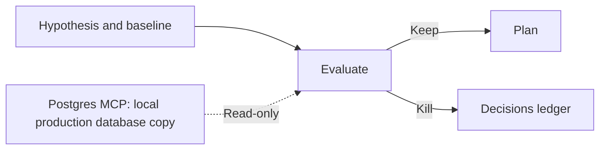

# Agent Workspace Harness

Agent sessions forget. Your repository does not.
The harness stores what already failed in Git, where **Claude Code, Codex, Cursor, and GitHub Copilot** all read it.
Install it into any existing repository with one command.

[Install](#installation-and-prerequisites) · [How agents share memory](#one-ledger-for-every-agent) · [Skills](#skills-and-workflows) · [Use case: PreGTM](_eval/examples/README.md)

## The problem

Coding agents lose their context at the end of each session.
The next session, another tool, or a teammate starts with no record of failed approaches.
The agent then proposes an approach that an earlier session already tested and rejected.
You must remember the failure and explain it again.

This problem is worst when the product itself uses AI.
A change to a classifier or an LLM pipeline can pass its tests and still make results worse.
Only a measurement shows the failure. That evidence must survive the session.

`AGENTS.md` and `CLAUDE.md` tell the agent how to work.
The decisions ledger tells the agent what already failed, why, and when to test it again.

## The decisions ledger

The harness keeps three records in the repository:

- **Decisions ledger** in `_plans/DECISIONS.md`: rejected approaches, evidence, and conditions for reconsideration.
- **Plans** in `_plans/`: the work, dependencies, checks, and progress.
- **Evaluations** in `_eval/`: hypotheses, measured results, and keep or kill verdicts.

Each ledger entry is a **negative architecture decision record (ADR)**: an approach that evidence ruled out.
An example below:

```markdown
### D58 — A strict Tier B proof floor destroys recall

- **Status**: settled 2026-08-19
- **Was**: Add a second verifier after classification. Keep only accounts
  that prove every minimum Tier B requirement with exact page quotes.
- **Why**: Cycle 003 tested 50 frozen qualified rows across campaigns 6
  and 12. The verifier kept five rows. Combined precision leak fell from
  0.20 to 0.00, but recall leak rose from 0.04 to 0.39. Campaign 6 kept
  no rows. Many true accounts do not publish every required fact on their
  sites. A missing fact is not proof that the account fails the ICP.
  Narrow criterion tests remain valid. Do not use a strict all-criteria
  second pass or treat `unknown` as excluded.
- **Scope**: This verifier, on 50 frozen qualified rows from campaigns 6
  and 12. The crawler fetched live websites for the test.
- **Reconsider when**: A narrower check tests one criterion and does not
  exclude accounts with missing evidence.
```

## One ledger for every agent

Each agent tool reads its own instruction file.
In the harness, every instruction file points to the same ledger.
The same skills are copied into the skill folder of each tool.

| Agent tool     | Instruction file                  | Skills                     |
| -------------- | --------------------------------- | -------------------------- |
| Claude Code    | `CLAUDE.md`                       | `.claude/skills/`          |
| Codex          | `AGENTS.md`                       | `.agents/skills/`          |
| Cursor         | `.cursor/rules/agent-harness.mdc` | `.cursor/skills/`          |
| GitHub Copilot | `.github/copilot-instructions.md` | `.github/agents/` (review) |

### How agents use the ledger

1. **Read.** Before it designs, `create-plan` reads the ledger index. The index groups entries by subsystem.
   The skill then reads only the entries for the subsystems that the work touches.
2. **Cite.** If the plan touches an entry, the plan cites its ID.
   The plan either respects the decision or states the new evidence that overturns it.
3. **Write.** When implementation or evaluation rules out an approach, the agent appends an entry.
   The entry must have scope, evidence, and a reconsideration condition.
   An approach without evidence stays **open**, not **settled**.
4. **Review.** The agent commits the entry locally. You review it in the diff before you push.

## The workflow

The core loop needs no database and no MCP server.


```mermaid
flowchart LR
    ledger["Decisions ledger"] -->|Read before design| plan["Plan"]
    plan --> implement["Implement and test"]
    implement --> review["Agent review, then human review"]
    implement -->|Record rejected approaches| ledger
```

It adds a measured keep or kill verdict for one hypothesis.


```mermaid
flowchart LR
    hypothesis["Hypothesis and baseline"] --> evaluate["Evaluate"]
    mcp["Postgres MCP: local production database copy"] -.->|Read-only| evaluate
    evaluate -->|Keep| plan["Plan"]
    evaluate -->|Kill| ledger["Decisions ledger"]
```

Tests check expected behavior. Evaluations measure results. The ledger keeps the evidence.
A keep verdict supports implementation and review. It does not merge or release a change.
You start each workflow, and you are responsible for the final review and release.

## Evaluate one hypothesis at a time

1. Set a baseline and a fixed sample.
2. State one change and the expected result before the test.
3. Run the test and compare the result with the target.
4. Record a keep or kill verdict. A kill verdict goes into the ledger.

**Use case: PreGTM.** A B2B lead pipeline used this loop on its website crawler.
A retry fix recovered 0 of 32 blocked requests. The ledger recorded that failure, and the next plan did not repeat it.
The measured alternative reduced blocked requests from 32 of 60 to 0.
Read the [PreGTM use case](_eval/examples/README.md), with the original evaluation records.

## Skills and workflows

A skill is a set of instructions that an agent follows inside your repository.
The core installation includes three skills. Two optional skills add evaluation and database access.

| Skill                                                                | What it does                                                                         | Installation     |
| -------------------------------------------------------------------- | ------------------------------------------------------------------------------------ | ---------------- |
| [`create-plan`](.claude/skills/create-plan/SKILL.md)                 | Reads past decisions and writes a plan with code context, dependencies, and checks.  | Core             |
| [`implement-plan`](.claude/skills/implement-plan/SKILL.md)           | Executes a plan, updates its checklist, tests changes, and reviews the result.       | Core             |
| [`review-change`](.claude/skills/review-change/SKILL.md)             | Independently reviews a change and returns evidence without edits. No plan required. | Core             |
| [`eval-loop`](.claude/skills/eval-loop/SKILL.md)                     | Tests one hypothesis and records evidence plus a keep or kill verdict.               | Evaluations      |
| [`mount-production-db`](.claude/skills/mount-production-db/SKILL.md) | Restores an S3 dump into a local Postgres sidecar and mounts it as a read-only MCP.  | Database sidecar |

## Installation and prerequisites

Run this command from the root of your app repository:

```bash
curl -fsSL https://raw.githubusercontent.com/fedeee/agent-workspace-harness/main/install.sh | bash
```

The installer asks which agent tools you use and copies the matching skills and rules.
It keeps your decisions ledger and your app README.
For existing `CLAUDE.md` and `AGENTS.md` files, it appends a harness section.
During merges, your existing MCP server entries and hook settings take precedence.

### Prerequisites

For the core harness, you need **Bash**, **Git**, an existing Git repository, and one supported coding agent.
The one-line installer also needs **curl**.

For evaluation the following features are also needed:

| Feature                                    | Prerequisites                                                     |
| ------------------------------------------ | ----------------------------------------------------------------- |
| MCP configuration and existing hook merges | `jq`                                                              |
| Codex MCP configuration                    | Python 3.11+                                                      |
| Shell deny hook and file evaluation        | Python 3                                                          |
| Context7 and Playwright MCP servers        | Node.js with `npx`                                                |
| Production database sidecar                | Docker with Compose, Python 3, AWS CLI, and access to the S3 dump |

Set `HARNESS_PYTHON=/path/to/python3.11` if Codex MCP configuration needs a newer Python than your default.
Core planning and memory need no database or MCP server.

## Run the workflows

### Plan and implement a change

In Codex, start with:

```text
$create-plan add a fuzzy search fallback
```

Review the generated file in `_plans/`, then pass its path to the implementation skill:

```text
$implement-plan _plans/<generated-plan>.plan.md
```

In Claude Code or Cursor, use `/create-plan` and `/implement-plan` with the same arguments.

The implementation skill follows dependencies in the plan.
Independent steps run as parallel workers in isolated Git worktrees.
Dependent steps run in order. The agent combines changes, runs checks, and reviews the result.
The agent commits locally and never pushes. You push after your review.

### Review an existing change

In Codex, review staged, unstaged, and relevant untracked files with:

```text
$review-change
```

To review committed branch changes from their common ancestor with `main`, use:

```text
$review-change base main
```

You can also pass `commit <sha>` or an implementation plan path.
Use `/review-change` in Claude Code or Cursor.
In Copilot, select the reviewer agent or ask it to follow `.claude/skills/review-change/SKILL.md`.

The skill starts a separate reviewer when the tool supports delegation.
The reviewer inspects the diff, requirements, related code, and tests. It does not apply fixes.
The report lists concrete defects, file references, evidence, and checks that could not run.
If delegation is unavailable, the report identifies the review as a self-review.
No implementation plan is required. The implementation skill also uses this review before completion.

### Run an evaluation

Test classifier or pipeline changes against fixed inputs before implementation.

1. Add one hypothesis and metric target to [`_eval/BACKLOG.md`](_eval/BACKLOG.md).
2. Run `$eval-loop H1` in Codex, or `/eval-loop H1` in Claude Code or Cursor.
3. Review the evidence and keep or kill verdict before implementation.

Classifier evaluation needs at least **20 labelled rows** in `_eval/GOLD.csv`; `unsure` rows do not count.
Never score `GOLD.example.csv`.
Keep a change only if precision error drops and false omission rate does not rise.
Pipeline evaluation needs a baseline and target; keep a change only if it meets the target without new errors.

Use frozen files, or run `mount-production-db` with an S3 dump for a temporary, read-only database copy.
Pass the full S3 URI; no specific bucket layout or manual download is required:

```text
$mount-production-db s3://your-bucket/path/to/app.dump
```

Use `/mount-production-db` in Claude Code or Cursor.
Configure AWS CLI access to the backup, with region and profile defaults in `_local/eval.env`.
The skill downloads the backup into `/tmp/eval-sidecar-<id>/` and restores it with `pg_restore`.

Postgres MCP connects the agent to this local sidecar as the read-only `eval_ro` user.
The agent can inspect data and diagnose pipeline errors without changes to the source database.
See the [evaluation guide](_eval/README.md) for metrics and the [database setup guide](_local/README.md) for configuration.

### Common questions

**Why not use the built-in memory of Claude Code or Cursor?**
Built-in memory belongs to one tool and one user.
A Claude Code memory is not available to Codex, to Cursor, or to a teammate.
The ledger is plain Markdown in Git. Every agent tool reads it, and teammates receive it with a pull.
You review each change to it in a diff, the same as code.

**How does the agent find the relevant entries in a large ledger?**
The ledger starts with an index that groups entry IDs by subsystem.
`create-plan` reads the index first. Then it reads only the entries for the subsystems that the work touches.
The agent does not read all entries for each plan.

**Does the agent write entries without approval?**
Yes, but the entry is not final until you review it.
The agent commits locally and never pushes. You see each new entry in the diff before you push.
You can edit or delete an entry, the same as a line of code.

**Can a wrong kill verdict block a good idea permanently?**
No. Each entry has a **Scope** and a **Reconsider when** condition.
The entry applies only inside its scope.
When new evidence meets the condition, a plan can reopen the entry.
A reversed entry keeps its earlier evidence and states the current decision.

## Future enhancements

### MCP memory infrastructure

Today, the ledger is a Markdown file in the repository. This works well during early development.
Complex workflows with many agents need structured retrieval.
We plan to move the ledger into a database behind an MCP server.

- Agents will query the relevant negative decisions. They will not read a large text file.
- Agents will use fewer tokens, and more context will stay available for the task.
- The ledger will become a shared memory service. It will follow the developer across IDEs and agent tools.

### Orchestration

Today, you start each skill manually at each step.
We plan to add an orchestrator that runs locally or in the cloud.
The orchestrator will manage the full cycle: plan, implement, and evaluate.

- It will assign domain-specific worker agents to specific skills.
- It will evaluate the output of each worker.
- It will run feedback loops that correct errors without human action.

---

License: MIT
